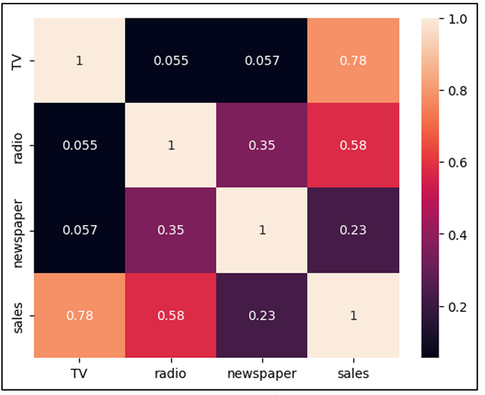
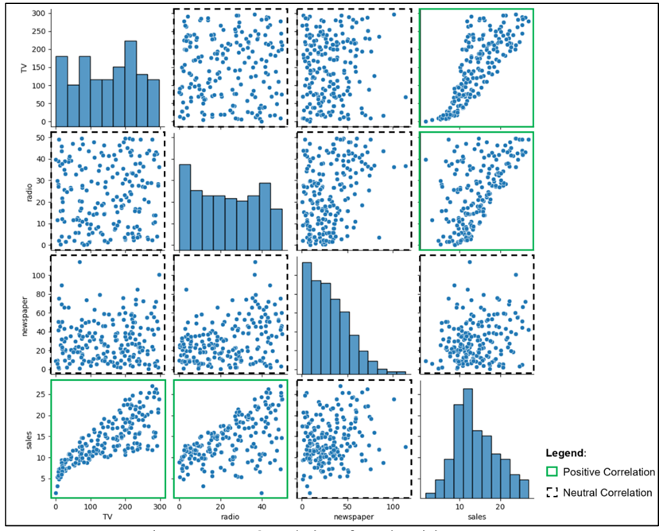
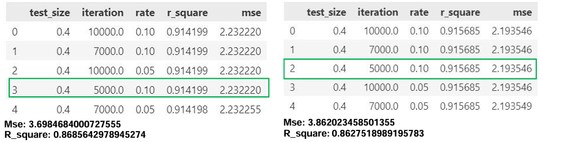
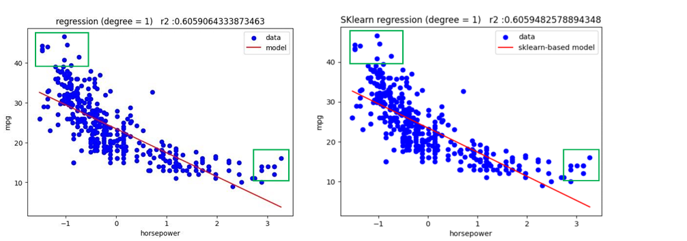
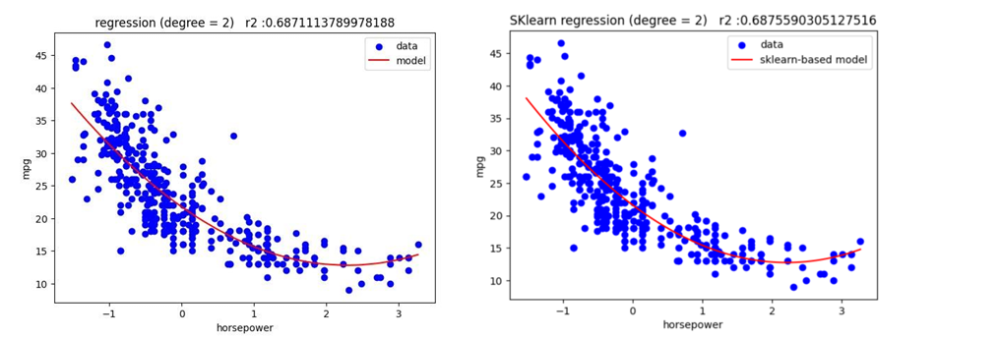
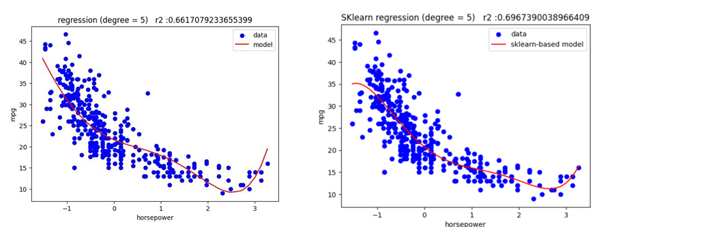
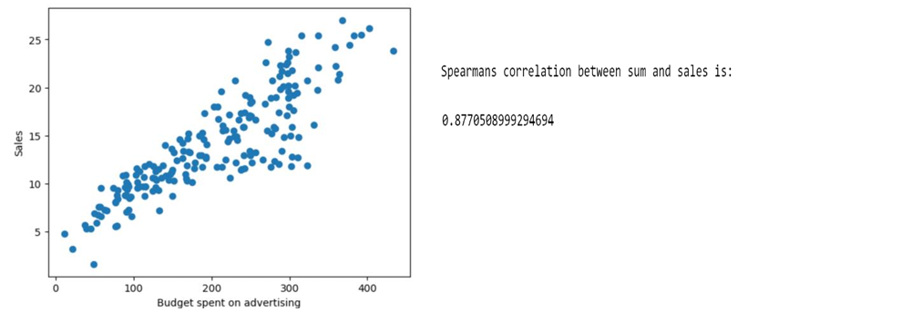

# **Predictive Modeling: Optimizing Sales and Performance**

## **Project Overview**

This project focuses on building predictive models to estimate sales based on advertising budgets across different media: **TV**, **Radio**, and **Newspaper**. The models are optimized using **gradient descent**, and their performance is evaluated using **R-squared (R²)** and **Mean Squared Error (MSE)** metrics. Polynomial regression is also explored to capture non-linear relationships in the dataset.

Key features of the project include:

- **Multiple Linear Regression**: Predicting sales based on TV, Radio, and Newspaper budgets.
- **Polynomial Regression**: Analyzing non-linear relationships between car horsepower and mpg.
- **Gradient Descent Optimization**: Fine-tuning model parameters to minimize the cost function.
- **Performance Evaluation**: Using R² and MSE to evaluate the model's performance.

## **Repository Architecture**

- **data/**: Contains the datasets used in the project.
  - `Advertising.csv`: Dataset for advertising budgets and sales.
  - `Auto.csv`: Dataset for automobile features and performance.
- **functions/**: Utility functions for data processing and model training.
  - `utils.py`: Contains helper functions for data loading and preprocessing.
- **Jupyter PDF EXPORT/**: Contains the exported PDFs of the Jupyter notebooks.
  - `main_advertising.pdf`: PDF export of the advertising model notebook.
  - `main_auto.pdf`: PDF export of the auto dataset model notebook.
- **Figures/**: Contains all the figures used in the analysis.
  - `Figure1.png` to `Figure14.png`: Figures for correlation heatmaps, regression models, and other visualizations.
- **main_advertising.ipynb**: Jupyter notebook for building the advertising sales prediction models.
- **main_auto.ipynb**: Jupyter notebook for analyzing the non-linear relationships in the auto dataset.


## **System Requirements**

- **Operating System**: Windows, macOS, or Linux
- **Hardware**: Minimum 4GB RAM, recommended 8GB for smooth performance.

## **Software and Tools**

- **Python 3.7+**
- **Jupyter Notebook**
- Libraries:
  - `numpy`
  - `pandas`
  - `matplotlib`
  - `seaborn`
  - `scikit-learn`

Install the necessary libraries:

```bash
pip install numpy pandas matplotlib seaborn scikit-learn
```

---

## **Data Description**

- **Advertising Dataset**: Contains advertising spend data for **TV**, **Radio**, and **Newspaper**, with the goal of predicting **Sales**.
- **Auto Dataset**: Contains information about cars, such as **horsepower** and **mpg**, which is used to explore non-linear relationships using polynomial regression.

---

## **Modeling Process**

### **1. Correlation Analysis**

We begin by analyzing the correlation between the variables in the **Advertising Dataset**. A correlation heatmap (Figure 1) is generated to understand the relationships between the predictors (**TV**, **Radio**, **Newspaper**) and the target (**Sales**).

<p align="center">
  
</p>

This heatmap clearly shows that **TV** has the highest positive correlation with **Sales**, followed by **Radio**, while **Newspaper** has a weaker correlation.

```python
# Example code for correlation analysis
import seaborn as sns
sns.heatmap(df.corr(), annot=True)
```

---

### **2. Multiple Linear Regression (TV, Radio, and Newspaper)**

Next, we build a **multiple linear regression** model to predict sales based on advertising budgets for **TV**, **Radio**, and **Newspaper**. Figure 2 shows the scatter plot of **TV**, **Radio**, and **Newspaper** vs. **Sales**.

<p align="center">
  
</p>

This scatter plot highlights the distribution of data and shows that **TV** and **Radio** budgets have a strong linear relationship with **Sales**, while **Newspaper** is less influential.

```python
# Example code for linear regression model
from sklearn.linear_model import LinearRegression
model = LinearRegression()
model.fit(X, y)
```

---

### **3. Gradient Descent Optimization**

We apply **gradient descent** to minimize the cost function and optimize the parameters of the linear regression model. Figure 3 illustrates the convergence of the cost function as the number of iterations increases.

<p align="center">
  
</p>

The plot shows that as the number of iterations increases, the cost function decreases, eventually stabilizing as the model parameters converge to their optimal values.

```python
# Example of Gradient Descent
from sklearn.linear_model import SGDRegressor
model = SGDRegressor(max_iter=5000, eta0=0.01, learning_rate='constant')
model.fit(X, y)
```

---

### **4. Polynomial Regression on Auto Dataset**

Since the relationship between **horsepower** and **mpg** is non-linear, we apply polynomial regression. The following figures show the results for polynomial regression with degrees 1, 2, and 5.

#### **Polynomial Regression - Degree 1**

Degree 1 polynomial regression is equivalent to linear regression. The plot in Figure 4 shows how a linear model fits the data between **horsepower** and **mpg**.

<p align="center">
  
</p>

#### **Polynomial Regression - Degree 2**

A quadratic model (degree 2) captures the curvature of the data better. Figure 5 shows how this model performs on the dataset.

<p align="center">
  
</p>

#### **Polynomial Regression - Degree 5**

A degree 5 polynomial regression captures even more complexity in the data. Figure 6 demonstrates how this model overfits to the data in some regions.

<p align="center">
  
</p>

```python
# Polynomial regression example
from sklearn.preprocessing import PolynomialFeatures
poly = PolynomialFeatures(degree=2)
X_poly = poly.fit_transform(X)
model.fit(X_poly, y)
```

---

### **5. Sales vs Budget Analysis**

We perform a **Spearman correlation analysis** to understand the relationship between the total advertising budget (sum of TV, Radio, and Newspaper) and sales. A high Spearman correlation indicates that higher budgets tend to result in higher sales.

Figure 7 shows the scatter plot of the total advertising budget vs sales, with the Spearman correlation coefficient displayed.

<p align="center">
  
</p>

The strong positive correlation demonstrates that the overall budget allocation is a good predictor of sales.

```python
# Example code for Spearman's correlation
corr, _ = spearmanr(df['adv_budget'], df['sales'])
plt.scatter(df['adv_budget'], df['sales'])
plt.xlabel('Budget spent on advertising')
plt.ylabel('Sales')
```

---

## **Model Evaluation**

The performance of the models is evaluated using **Mean Squared Error (MSE)** and **R-squared (R²)**.

| Model           | R² Score | MSE    |
|-----------------|----------|--------|
| Linear Regression (TV, Radio) | 0.978 | 0.611 |
| Polynomial Regression (Degree 2) | 0.687 | 1.013 |

---

## **Conclusion**

This project demonstrates how multiple linear and polynomial regression can be applied to predict advertising sales and explore the relationship between car horsepower and fuel efficiency. Through the use of gradient descent, the model parameters are optimized, yielding a better fit to the data.

The results show that while linear regression works well for predicting sales, polynomial regression provides a better fit for modeling non-linear relationships, particularly in the auto dataset.

---

## **How to Run the Project**

1. Clone the repository:

   ```bash
   git clone https://github.com/Yass123krk/Portfolio.git
   cd Portfolio/Projects/Predictive_Modeling_Optimizing_Sales_and_Performance
   ```

2. Install the required Python packages:

   ```bash
   pip install -r requirements.txt
   ```

3. Open the **Jupyter Notebook** and run the cells:

   ```bash
   jupyter notebook
   ```

---

## **Contact Information**

For any inquiries or suggestions, feel free to contact me at [yassercranfield@gmail.com].
